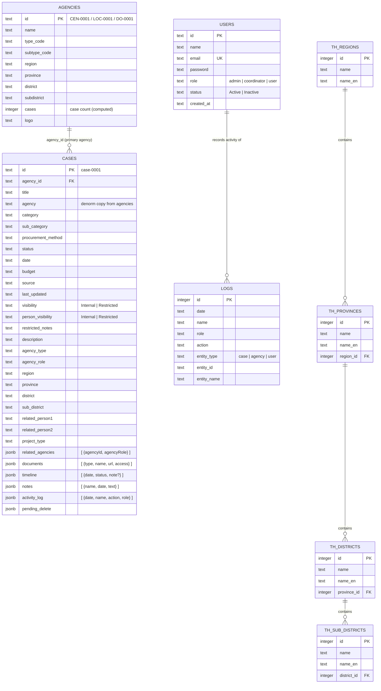

# AppMustshare — ER Diagram (Current System)

> อัปเดตจาก ER diagram เดิม ให้ตรงกับ database จริง (PostgreSQL)
> สร้างจาก: `node import_agencies.js` + `node import_cases.js`

---

## Mermaid Diagram

วิธีดู: วางโค้ดนี้ใน https://mermaid.live หรือเปิดใน draw.io (Extras → Edit Diagram)



---

## JSONB Embedded Structures

เนื่องจาก `cases` ใช้ JSONB แทน separate tables ข้อมูลด้านล่างนี้ **ไม่มี table จริง** แต่แสดงโครงสร้างข้อมูลภายใน

### `cases.related_agencies[]`
```
{
  agencyId:   text   → ref agencies.id
  agencyRole: text   เช่น "เจ้าของโครงการ"
}
```

### `cases.documents[]`
```
{
  type:   "Link" | "File"
  name:   text
  url:    text
  access: "Public" | "Internal" | "Restricted"
}
```

### `cases.timeline[]`
```
{
  date:   "YYYY-MM-DD"
  status: text
  note:   text  (optional)
}
```

### `cases.notes[]`
```
{
  name: text   (ผู้เขียน)
  date: "YYYY-MM-DD"
  text: text
}
```

### `cases.activity_log[]`
```
{
  date:   "YYYY-MM-DD"
  name:   text
  action: text
  role:   text
}
```

---

## เปรียบเทียบ ER เก่า vs ปัจจุบัน

| Entity ใน ER เก่า     | ปัจจุบัน                                  |
|----------------------|------------------------------------------|
| ISSUE_CATEGORY       | ❌ ไม่มี table → `cases.category` (text)  |
| ISSUE_SUBCATEGORY    | ❌ ไม่มี table → `cases.sub_category` (text) |
| CASE_STATUS          | ❌ ไม่มี table → `cases.timeline` (jsonb) |
| CASE_NOTE            | ❌ ไม่มี table → `cases.notes` (jsonb)    |
| CASE_ATTACHMENT      | ❌ ไม่มี table → `cases.documents` (jsonb)|
| CASE_AGENCY          | ❌ ไม่มี table → `cases.related_agencies` (jsonb) |
| CASE_ACTIVITY_LOG    | ❌ ไม่มี table → `cases.activity_log` (jsonb) |
| USER                 | ✅ มี → `users` table                    |
| CASE                 | ✅ มี → `cases` table (ขยายมากขึ้น)      |
| AGENCY               | ✅ มี → `agencies` table                 |
| (ไม่มี)              | ✅ เพิ่ม → `logs` table                  |
| (ไม่มี)              | ✅ เพิ่ม → `th_regions/provinces/districts/sub_districts` |
